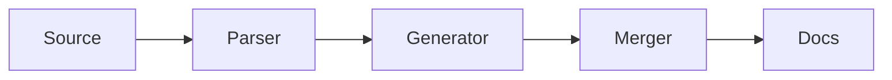

# Components

Ovellum ships a small set of content components — callouts, steps, cards, and
tabs — written with the **`:::` directive syntax**. They're plain Markdown
([CommonMark directives](https://talk.commonmark.org/t/generic-directives-plugins-syntax/444)),
not JSX or a custom format, so your source stays portable and the output is just
HTML + CSS. Everything below is theme-styled and works in light and dark.

## Callouts

Flag a passage as a note, tip, or warning. Open a fenced block with `:::` and the
type:

```markdown
:::note
Ovellum sanitizes all Markdown before rendering.
:::

:::warning{title="Heads up"}
Renaming a documented symbol orphans its hand-written prose.
:::
```

Types: `note`, `tip`, `important`, `warning`, `caution`. The label defaults to the
type's name; override it with `{title="…"}`.

> [!NOTE]
> The GitHub-style alert syntax — `> [!NOTE]`, `> [!WARNING]`, … — produces the
> same callouts, so either form works.

## Steps

A numbered walkthrough. The outer `::::steps` wraps one `:::step` per item:

```markdown
::::steps
:::step{title="Install"}
`npm install -D ovellum`
:::

:::step{title="Initialize"}
Run `npx ovellum init` and answer the prompts.
:::
::::
```

Numbers are added automatically. `{title="…"}` is optional.

## Cards

A responsive grid of cards. Add `href` to make a whole card a link:

```markdown
::::cards
:::card{title="Manual mode" href="/docs/guides/manual-mode/"}
Build a static site from Markdown.
:::

:::card{title="Hybrid mode" href="/docs/guides/hybrid-mode/"}
Generate from source, keep your prose.
:::
::::
```

A card without `href` renders as a plain (non-clickable) card.

## Tabs

Show alternatives in one place — install commands, language variants, OS steps.
The outer `::::tabs` wraps one `:::tab` per panel; `{label="…"}` names the tab:

```markdown
::::tabs
:::tab{label="npm"}
`npm install -D ovellum`
:::

:::tab{label="pnpm"}
`pnpm add -D ovellum`
:::
::::
```

The first tab is shown by default; the tablist is keyboard-navigable (arrow
keys). With JavaScript disabled, every panel is shown in full, so no content is
ever hidden from a reader or a crawler.

## Code groups

Tabbed code blocks — the common "npm / pnpm / yarn" switcher. Wrap fenced blocks
in `:::code-group`; each tab is labeled by the fence's language, or by a
`title="…"` on the info string:

````markdown
:::code-group
```bash
npm install -D ovellum
```

```bash title="pnpm"
pnpm add -D ovellum
```
:::
````

`:::code-group` uses a single `:::` (not `::::`) even though it wraps blocks —
its children are code fences, not directives, so there's no nesting to
disambiguate.

## Diagrams (Mermaid)

A ` ```mermaid ` code block renders as a [Mermaid](https://mermaid.js.org)
diagram:

````markdown

````

The Mermaid runtime is **lazy-loaded, and only on pages that contain a diagram**
— so the default site (and every diagram-free page) ships zero extra JavaScript.
It loads from a pinned CDN; if a page can't reach it, the diagram source stays
visible as a readable fallback. To avoid the third-party request, self-host the
runtime and point [`site.mermaid.url`](/docs/reference/config/#mermaid) at it, or
set `site.mermaid.enabled: false` to turn diagrams off entirely.

## Using `.mdx` files

Ovellum treats `.mdx` files as Markdown — they're picked up, routed, and rendered
just like `.md`. There's **no JSX evaluation**: an `.mdx` file is a Markdown file
with a different extension, so all the directives above work, but a JSX
`<Component />` is not executed. Use `.mdx` if your editor or tooling expects it;
plain `.md` is otherwise identical.

## Nesting rule

A component that **contains other directives** (steps, cards, tabs) must use one
more colon than its children — `::::steps` around `:::step`. This is how the
parser tells an outer block from an inner one. Callouts and code groups hold
ordinary Markdown / code, so they just use `:::`.
